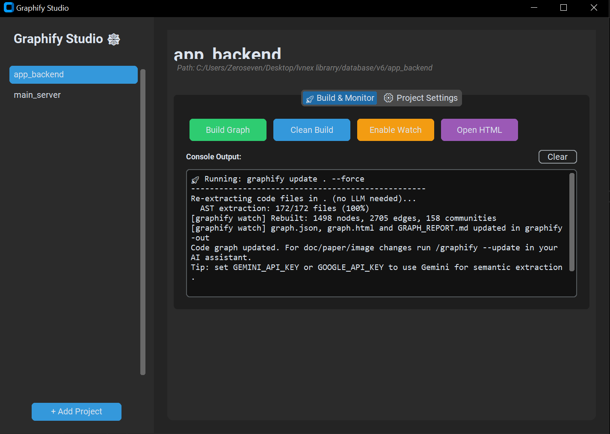

# 🕸️ Graphify Studio - Easy Setup

**The professional GUI dashboard for the Graphify Knowledge Graph Pipeline.**

Graphify Studio provides a sleek, high-performance interface to manage your code's knowledge graph. From building semantic relationship maps to monitoring code changes in real-time, the Studio makes complex architecture visualization as simple as a single click.



## 🚀 Features

- **One-Click Build**: Generate your knowledge graph using Normal (Local) or Deep (AI) extraction modes.
- **Real-Time Watcher**: Automatically updates your graph as you write code, with smart background process detection.
- **Project Manager**: Manage multiple projects from a single sidebar with active status indicators.
- **Zero Configuration**: Auto-installs dependencies and detects Antigravity/Git Hook integrations automatically.
- **Safe Extraction**: Integrated API key management with secure environment injection.

## 🛠️ Installation

Just download `graphify_studio.py` and run it! The studio will automatically ensure you have the latest `graphifyy` library installed.

```bash
python graphify_studio.py
```

## 📦 Dependencies

- Python 3.10+
- `customtkinter`
- `graphifyy` (Auto-installed on first run)

## 📖 How to Use

1. **Add Project**: Click the "+" button in the sidebar and select your project folder.
2. **Configure**: Select your mode (Normal or Deep) and add your GEMINI_API_KEY if using AI mode.
3. **Build**: Click "Build Graph" to generate your first `graph.html`.
4. **Enable Watch**: Turn on the watcher to keep your graph in sync with your code changes.

---

*Powered by [Graphify]([https://github.com/ahmed0x77/graphify](https://github.com/safishamsi/graphify))*
